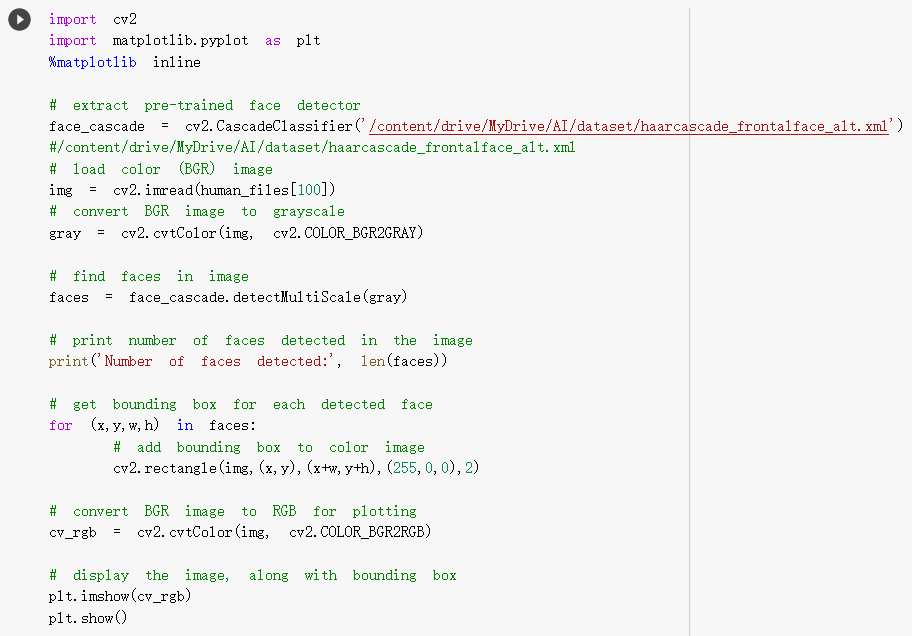
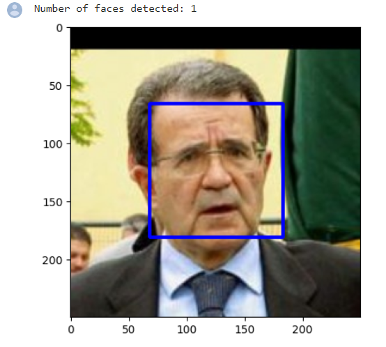

# 人狗辨識，南華大學
•人狗辨識  
# 目錄
•載入資料   
•偵測人類  
•偵測狗  
•建立 CNN 以對狗進行分類  
•建立 CNN 以對人進行分類  
•開始進行分析  
•參考資料
# 載入資料   
•https://drive.google.com/file/d/1nqIZ4BOmHhnKAJhAaI3G6cuXzW12kKf8/view?usp=sharing  
# 偵測人類  
  
# 偵測狗  
  
# 建立 CNN 以對狗進行分類  
# 建立 CNN 以對人進行分類  
# 開始進行分析  
# 參考資料  
https://github.com/tfesenko/Dog-Breed-Classifier/blob/master/dog_app.ipynb
